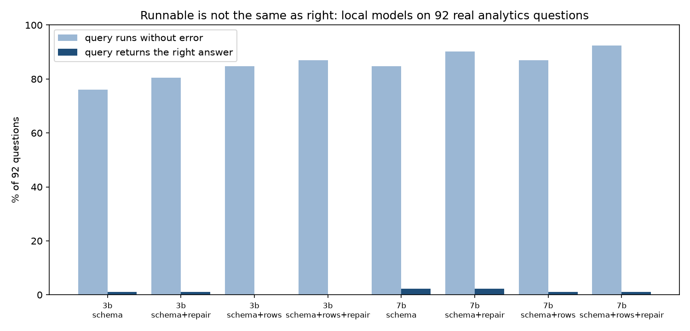

# Text-to-SQL Evaluation on Real Analytics Questions

[](https://github.com/prhoguns/text-to-sql-eval/actions/workflows/ci.yml)

How well can a small open model that runs on a laptop turn a business question into correct SQL? This
measures it on **92 questions I had already answered by hand** across five of my analytics projects:

- Toronto police crime
- Network intrusion flows
- Industrial-control sensor data
- Bank account fraud
- Windows logons

Every question has a gold query and a real database behind it, so a generated query is graded by
**what it returns**, not by how it looks.

**Stack:** Python 3.14 · DuckDB · Ollama (Qwen2.5-Coder 3B and 7B, run locally) · pytest.

**Result in one line:** the models wrote SQL that ran up to 92% of the time and was right at most 2% of the time.

## Method

- **Questions:** the first comment line of each source query; the query is the gold answer. Notes about
  technique are kept out of the question ([`questions.py`](evalsql/questions.py)).
- **Grading:** execution accuracy ([`compare.py`](evalsql/compare.py)). The generated and gold queries run
  on the same database, and the results must hold the same rows. Row and column order and column names
  are ignored, and numbers are compared at one decimal. *Relaxed* also accepts extra columns.
- **Conditions:**
  - `schema`: tables and columns only
  - `schema+rows`: plus three example rows per table
  - `+repair`: one retry that shows the model its own DuckDB error
- **Safety:** generated SQL runs on a read-only connection with a 60-second limit, so a bad query can
  neither change the data it is graded against nor hang the run.
- **Gold answers checked first** ([`check_gold.py`](evalsql/check_gold.py)). Each gold query runs on one
  thread and again on eight, and must return identical results. This found **eight queries in the source
  repositories whose results changed from run to run**: ties under `ORDER BY ... LIMIT`, and one `NTILE`
  over tied scores. They were fixed at the source, and the corrected results committed there, before any
  model was graded.

## Results (9 October 2026)

Qwen2.5-Coder 3B and 7B through Ollama on a laptop GPU, temperature 0, fixed seed, 1,024-token answer
cap. Per-database and failure-type tables are in [`results/SUMMARY.md`](results/SUMMARY.md).



| Model | Condition | Correct (strict) | Runs without error |
|---|---|---:|---:|
| 3B | schema | 1/92 | 76% |
| 3B | schema + example rows + repair | 0/92 | 87% |
| 7B | schema | **2/92** | 85% |
| 7B | schema + example rows + repair | 1/92 | **92%** |

What this shows:

1. **Small local models can't answer these questions.** Across eight configurations only two questions
   were ever answered correctly. One of them is reading a ready-made `baseline` table; the other is a
   simple group-by of labels by protocol.
2. **Runnable is not right.** Example rows and a chance to repair the query took the 7B model from 85% to
   92% of queries that run. Correctness did not move. Each fix makes the output look more trustworthy
   without making it more correct: in a reporting tool that is the dangerous direction.
3. **The commonest real failure is invented data.** In a hand review of 25 failures
   ([`results/failure_review.md`](results/failure_review.md)):
   - 6 filtered on values that do not exist, such as `status = 'Failed'` where failures are an event ID,
     and quietly returned nothing.
   - 11 had the wrong logic.
   - 4 had SQL errors.
4. **Strict grading undercounts, but not by much.** In the same review, 4 of the 25 failures were
   defensible answers in a different shape: a fraction instead of a percentage, an overall figure instead
   of a per-day one. About one failure in six, so a lenient score would be roughly 15–20%, not 1–2%.
   I report the strict number and give the review, rather than re-grade by hand.

Limits:
- These are terse questions written for myself, with no data dictionary.
- The gold answers make choices the questions do not always state.
- Two small models on one machine.

The obvious next condition is a data dictionary in the prompt, like the guide the
[Toronto data MCP server](https://github.com/prhoguns/toronto-data-mcp) gives an assistant. That turns
row 3 into something the model can know, rather than guess.

## Reproduce

```bash
pip install -r requirements.txt
ollama pull qwen2.5-coder:3b && ollama pull qwen2.5-coder:7b
# build the five source databases with each repository's own scripts (see datasets.toml for paths)
python -m evalsql.questions && python -m evalsql.check_gold
scripts/run_all.sh          # resumable; writes results/*.jsonl and results/SUMMARY.md
```

`pytest` covers the grading rules, SQL extraction from model replies, the read-only connection and the
query timeout. It needs no model or data.
